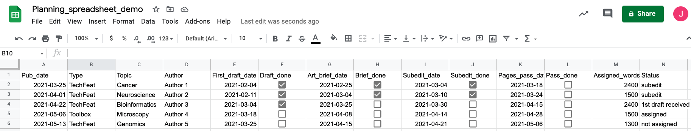
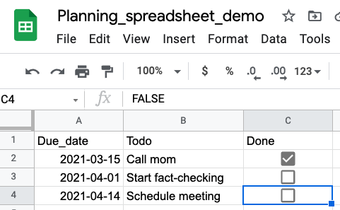

# todo.R -- convert a spreadsheet of dates into a todo list

Given a comma-separated values (CSV) file with the following columns: Pub_date, Type, Topic, Author, First_draft_date, Draft_done, Art_brief_date, Brief_done, Subedit_date, Subedit_done, Pages_pass_date, Pass_done, Assigned_words and Status, this script creates a to-do list of upcoming 'milestones' -- in this case, the due dates for first draft, art brief, subediting, and article pass.

In other words, this:

becomes this:

    # A tibble: 13 x 5
       Date       Pub_date   Remaining Topic          Milestone  
       <date>     <date>     <drtn>    <chr>          <chr>      
     1 2021-03-18 2021-03-25  6 days   Cancer         Pages pass 
     2 2021-03-18 2021-05-06  6 days   Microscopy     First draft
     3 2021-03-24 2021-04-01 12 days   Neuroscience   Pages pass 
     4 2021-03-25 2021-04-22 13 days   Bioinformatics Art brief  
     5 2021-03-25 2021-05-13 13 days   Genomics       First draft
     6 2021-03-30 2021-04-22 18 days   Bioinformatics Subedit    
     7 2021-04-08 2021-05-06 27 days   Microscopy     Art brief  
     8 2021-04-14 2021-05-06 33 days   Microscopy     Subedit    
     9 2021-04-15 2021-04-22 34 days   Bioinformatics Pages pass 
    10 2021-04-15 2021-05-13 34 days   Genomics       Art brief  
    11 2021-04-21 2021-05-13 40 days   Genomics       Subedit    
    12 2021-04-28 2021-05-06 47 days   Microscopy     Pages pass 
    13 2021-05-06 2021-05-13 55 days   Genomics       Pages pass 

Additional to-do-list items not associated with a given article can also be folded in. Assuming you have a second (optional) spreadsheet called Other_todos.csv with columns for Due_date, Todo (text) and Done (TRUE/FALSE), this:

becomes:

    # A tibble: 15 x 5
       Date       Pub_date   Remaining Topic               Milestone  
       <date>     <date>     <drtn>    <chr>               <chr>      
     1 2021-03-18 2021-03-25  2 days   Cancer              Pages pass 
     2 2021-03-18 2021-05-06  2 days   Microscopy          First draft
     3 2021-03-24 2021-04-01  8 days   Neuroscience        Pages pass 
     4 2021-03-25 2021-04-22  9 days   Bioinformatics      Art brief  
     5 2021-03-25 2021-05-13  9 days   Genomics            First draft
     6 2021-03-30 2021-04-22 14 days   Bioinformatics      Subedit    
     7 2021-04-01 NA         16 days   Start fact-checking To-do      
     8 2021-04-08 2021-05-06 23 days   Microscopy          Art brief  
     9 2021-04-14 2021-05-06 29 days   Microscopy          Subedit    
    10 2021-04-14 NA         29 days   Schedule meeting    To-do      
    11 2021-04-15 2021-04-22 30 days   Bioinformatics      Pages pass 
    12 2021-04-15 2021-05-13 30 days   Genomics            Art brief  
    13 2021-04-21 2021-05-13 36 days   Genomics            Subedit    
    14 2021-04-28 2021-05-06 43 days   Microscopy          Pages pass 
    15 2021-05-06 2021-05-13 51 days   Genomics            Pages pass 

# Usage
1. Download this Git repository
2. By default, the script assumes dates will be given in the format "YYYY-MM-DD". If you use another format, eg "MM/DD/YYYY", use a plain-text editor (eg, Windows Notepad or macOS TextEdit) to indicate that on line 21.
3. The script also assumes the CSVs containing your to-do list will be in the same directory as the script, with the names `Planning_spreadsheet_demo.csv` and `Other_todos.csv`. If that is not the case, adjust the file paths on lines 24-25 accordingly.
4. At the command line, navigate to the directory where you downloaded this script and execute `Rscript todo.R` (macOS) or `Rscript.exe todo.R` (Windows).

# License

Copyright 2021 Jeffrey M. Perkel

Redistribution and use in source and binary forms, with or without modification, are permitted provided that the following conditions are met:

1.  Redistributions of source code must retain the above copyright notice, this list of conditions and the following disclaimer.
2.  Redistributions in binary form must reproduce the above copyright notice, this list of conditions and the following disclaimer in the documentation and/or other materials provided with the distribution.
3.  Neither the name of the copyright holder nor the names of its contributors may be used to endorse or promote products derived from this software without specific prior written permission.

THIS SOFTWARE IS PROVIDED BY THE COPYRIGHT HOLDERS AND CONTRIBUTORS "AS IS" AND ANY EXPRESS OR IMPLIED WARRANTIES, INCLUDING, BUT NOT LIMITED TO, THE IMPLIED WARRANTIES OF MERCHANTABILITY AND FITNESS FOR A PARTICULAR PURPOSE ARE DISCLAIMED. IN NO EVENT SHALL THE COPYRIGHT HOLDER OR CONTRIBUTORS BE LIABLE FOR ANY DIRECT, INDIRECT, INCIDENTAL, SPECIAL, EXEMPLARY, OR CONSEQUENTIAL DAMAGES (INCLUDING, BUT NOT LIMITED TO, PROCUREMENT OF SUBSTITUTE GOODS OR SERVICES; LOSS OF USE, DATA, OR PROFITS; OR BUSINESS INTERRUPTION) HOWEVER CAUSED AND ON ANY THEORY OF LIABILITY, WHETHER IN CONTRACT, STRICT LIABILITY, OR TORT (INCLUDING NEGLIGENCE OR OTHERWISE) ARISING IN ANY WAY OUT OF THE USE OF THIS SOFTWARE, EVEN IF ADVISED OF THE POSSIBILITY OF SUCH DAMAGE.
